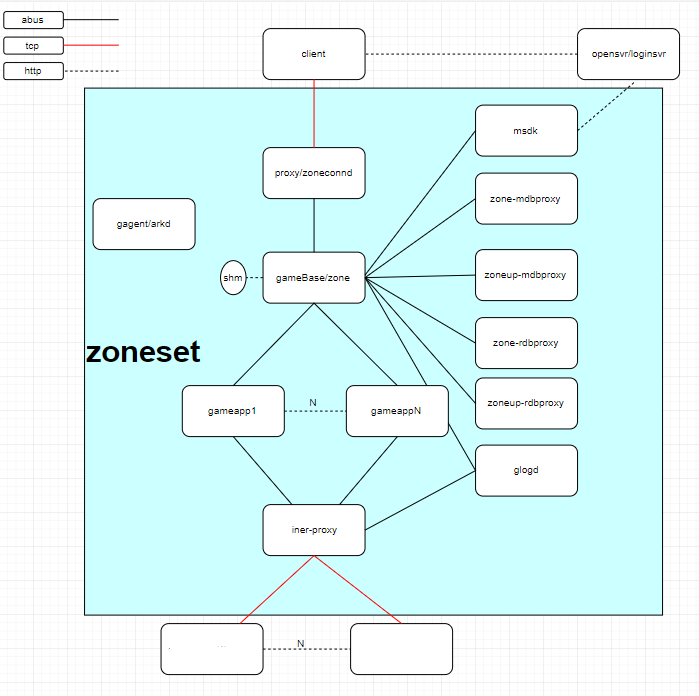

# ArkGameFrame

 1.rpc grpc c的实现抄一套 或者腾讯的tars TAF
 
 2.模块间进程间的健康系统，通道的可用性，进程负载
 
 3.rpc是否需要为上层提供可靠服务 超时机制 undo + 2第二条的健康系统
 
 4.是否有必要引入无栈协程(没太大必要,程序员需要知道自己在做什么，无状态服务器才需要这鬼东西)
 
 5.服务的降级和熔断策略
 
 6.zone（gamesvr)的多进程调度 游戏逻辑微服务化
 
 7.进程的崩溃处理与恢复 共享内存 数据逻辑分离
 
 8.消息的可靠传输 抄tbus
 
 9.内存越界保护手段 1.系统支持mprotect 2.应用层支持 数据修改的封装  禁止共享内存数组直接的使用，禁止数据指针的直接使用
 
 10.httpserver （可以考虑其他更高效的语言）作用 对外提供服务器列表和账号认证服务 或者 接第三方sdk的服务器
 
 11.实体编程的引入（可抄bigworld 那套） 远程rpc mailbox 思想的引入 实体在进程间的切换 同一个zoneset 只需要在 role上记一个 procid role数据只在 base上修改 （防止读取数据错误 一次rpc返回前gamebase锁住这个entity）
 
 
 以下为非主要内容-----------------------------------------------------------------------------------------
 
 12.守护进程 core了之后自动拉起 （croe的qos告警 可通过检测core文件进程是否存在来判断， 没有守护进程期间直接用supervisor）
 
 13.运营后台
 
 14.动态共享内存（完成以上所有的事情前都不做，性价比极低 现在内存不值钱）
 
 
